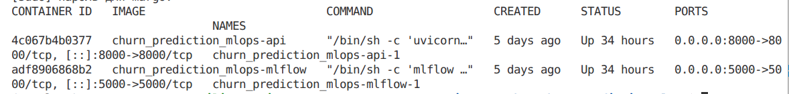
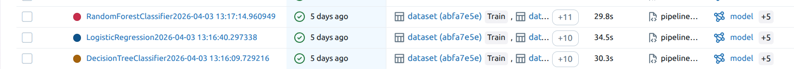
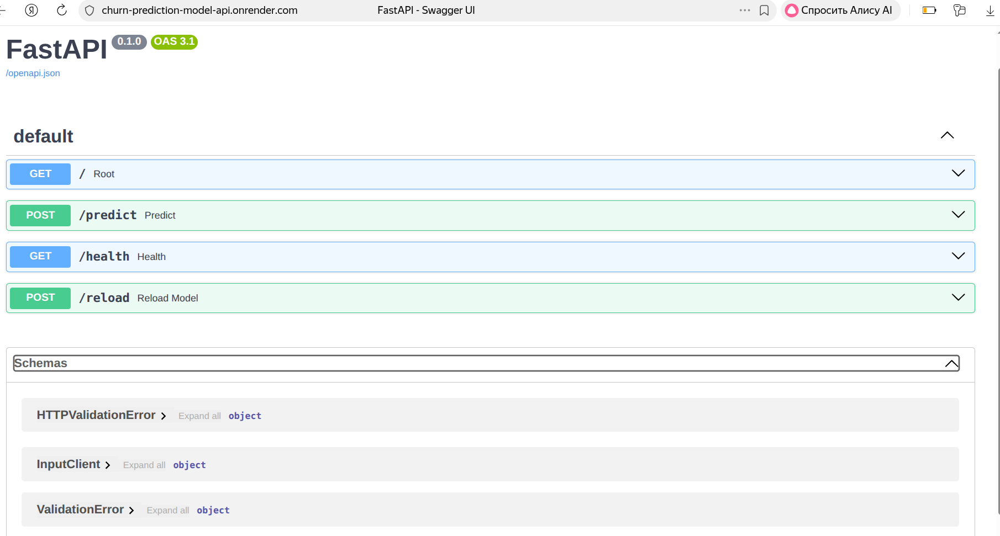

# Churn Prediction Platform

## О проекте

Это MLOps-проект для предсказания оттока клиентов телеком-компании. Проект охватывает большую часть жизненного цикла модели: от экспериментов до деплоя.

**Проблема:** Операторам связи нужно удерживать клиентов. Модель предсказывает, кто может уйти, чтобы компания могла предложить выгодные условия заранее.

**Результат:** RandomForestClassifier с F1-weighted 0.85 на валидации и 0.83 на тесте.

---

## Что внутри

### Микросервисная архитектура

| Сервис | Технологии | Что делает |
|--------|-----------|------------|
| **Trainer** | Python, scikit-learn, MLflow | Обучает модели, логирует эксперименты, регистрирует лучшую, отключается |
| **MLflow Server** | MLflow, SQLite | Хранит эксперименты и модели, управляет версиями, работает постоянно |
| **API** | FastAPI, Uvicorn | Отдаёт предсказания, проверяет здоровье, перезагружает модель, работает постоянно |


### API эндпоинты

| Эндпоинт | Метод | Что возвращает |
|----------|-------|----------------|
| `/predict` | POST | Предсказание (0, 1, 2) |
| `/health` | GET | Статус сервиса |
| `/reload` | POST | Перезагрузка модели из MLflow |
| `/docs` | GET | Swagger документация |

---

## Как запустить

### Всё сразу (локально)


Отредактируйте созданные .env файлы, подставив свои значения (если нужно). 
Для локального запуска примеров достаточно.

```bash
git clone https://github.com/m-bushliakova/churn_prediction_mlops.git
cd churn_prediction_mlops
docker-compose up -d
```




После запуска:
- API документация: http://localhost:8000/docs
- MLflow UI: http://localhost:5000



### Отдельные сервисы

```bash
# Только MLflow и API
docker-compose up -d mlflow api

# Обучение модели (один раз в начале или при проведении новых экспериментов)
docker-compose up trainer

# Перезапуск API после обновления модели (если добавили новые признаки например)
docker-compose restart api
```

### Пример запроса

```bash
curl -X POST http://localhost:8000/predict \
  -H "Content-Type: application/json" \
  -d '{
    "customer_id": "CUST001",
    "gender": "Male",
    "age": 35,
    "married": "Yes",
    "tenure_in_months": 24,
    "monthly_charge": 89.99
  }'
```

Ответ:
```json
{"class_ind": 0}
```

или в блокноте
```python
import requests
import json

url = "http://127.0.0.1:8000/predict"

data = {
    "customer_id": "CUST001",
    "gender": "Male",
    "age": 75,
    "married": "Yes",
    "number_of_dependents": 2,
    "city": "Los Angeles",
    "zip_code": 90001,
    "latitude": 34.0522,
    "longitude": -118.2437,
    "number_of_referrals": 3,
    "tenure_in_months": 24,
    "offer": "Offer A",
    "phone_service": "Yes",
    "avg_monthly_long_distance_charges": 15.5,
    "multiple_lines": "No",
    "internet_service": "Yes",
    "internet_type": "Fiber Optic",
    "avg_monthly_gb_download": 150.5,
    "online_security": "Yes",
    "online_backup": "No",
    "device_protection_plan": "Yes",
    "premium_tech_support": "No",
    "streaming_tv": "Yes",
    "streaming_movies": "Yes",
    "streaming_music": "No",
    "unlimited_data": "Yes",
    "contract": "Month-to-Month",
    "paperless_billing": "Yes",
    "payment_method": "Credit Card",
    "monthly_charge": 89.99,
    "total_charges": 2159.76,
    "total_refunds": 0,
    "total_extra_data_charges": 0,
    "total_long_distance_charges": 45.2,
    "total_revenue": 2204.96
}

response = requests.post(url, json=data)

print(f"Status Code: {response.status_code}")
print(f"Response: {response.json()}")

```

Ответ:
```
Status Code: 200
Response: {'class_ind': 2}
```
---

## Деплой на Render (только API модели)

API также задеплоено отдельно на Render. Модель встроена в Docker образ, что делает сервис полностью самодостаточным.

**URL:** https://churn-prediction-model-api.onrender.com

**Особенности:**
- Модель загружается из локального файла
- При недоступности MLflow сервера — сервис работает автономно
- Health check и перезагрузка модели работают аналогично локальной версии

**Swagger документация:** https://churn-prediction-model-api.onrender.com/docs



## Архитектура проекта

```
churn_prediction_mlops/
├── services/
│   ├── mlflow_server/     # MLflow
│   ├── model_api/         # FastAPI
│   └── trainer/           # Обучение моделей и сохранение экспериментов в ml flow
├── notebooks/             # EDA и эксперименты
├── data/                  # Датасеты
├── models/                # Резервная копия модели
└── mlruns/                # Артефакты MLflow
```

---
## Ключевые особенности

**ML модели**

Обучение и сравнение трёх моделей: RandomForest, LogisticRegression, DecisionTree. Для каждой модели проводится кросс-валидация на 5 фолдах. Выбор лучшей модели происходит по метрике F1-weighted (учитывает дисбаланс классов). Финальная модель оценивается на отложенной тестовой выборке.

**MLflow**

Логирование всех экспериментов: параметры моделей, метрики на валидации, confusion matrix, classification report. Модели регистрируются в Model Registry. Лучшая модель автоматически продвигается в стадию Production. Можно сравнить разные версии модели в MLflow UI.

**FastAPI**

Асинхронные эндпоинты для предсказаний. Входные данные валидируются через Pydantic модели. Автоматическая генерация Swagger документации. Graceful shutdown и обработка ошибок.

**Docker**

Три независимых сервиса (MLflow, API, Trainer) в изолированной сети. Volumes для персистентности данных и артефактов. Переменные окружения через .env файлы. Сервис обучается один раз и завершается, MLflow и API работают постоянно.

**Production готовность**  

При недоступности MLflow сервера API автоматически переключается на локальную резервную модель (graceful degradation). Health check эндпоинт для мониторинга. Возможность перезагрузить модель из MLflow без остановки сервиса через `/reload`. Все запросы логируются.

---

## Как переиспользовать

### Добавить новую модель

1. В `services/trainer/src/pipeline.py` добавить модель в список `models`
2. Запустить `docker-compose up trainer`
3. Лучшая модель автоматически зарегистрируется в MLflow и уйдёт в Production

### Добавить новый признак

1. Изменить `InputClient` в `services/model_api/shema.py`
2. Пересобрать API: `docker-compose build api`
3. Перезапустить: `docker-compose up -d api`

---

## Что дальше

### Что можно улучшить

- **CI/CD** — GitHub Actions для автоматических тестов при пуше (линтеры, pytest)
- **Мониторинг** — Prometheus + Grafana для отслеживания метрик API (RPS, latency, ошибки)
- **Data drift** — отслеживание изменения распределения входных признаков
- **Model drift** — мониторинг ухудшения качества предсказаний
- **А/Б тестирование** — сравнение разных версий моделей на реальном трафике
- **Feature store** — централизованное хранение и версионирование признаков
- **Автоматический ретрейн** — переобучение модели по расписанию или при дрифте
- **DVC** — версионирование датасетов для воспроизводимости
- **Unit тесты** — покрытие API и trainer логики
- **Integration тесты** — проверка взаимодействия сервисов
- **Нагрузочное тестирование** — locust или k6 для проверки производительности